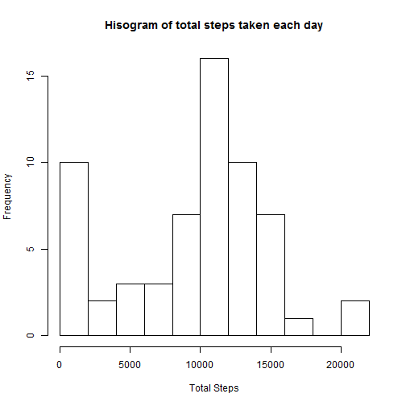
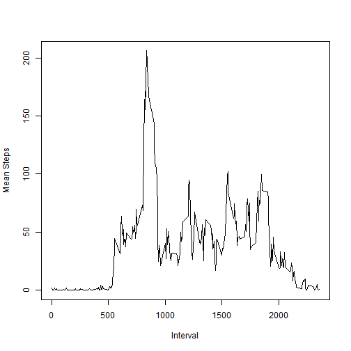
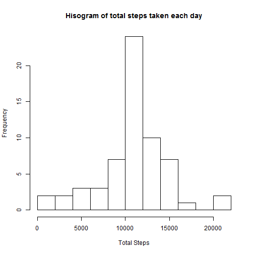

# Reproducible Research: Peer Assessment 1


## Loading and preprocessing the data


```r
xx <- read.csv(unzip('activity.zip'))

xx$date=as.Date(as.character(xx$date))
```

## What is mean total number of steps taken per day?


```r
totsteps=tapply(xx$steps,xx$date,sum,na.rm=T)
hist(totsteps,15,xlab='Total Steps',main='Hisogram of total steps taken each day')
```

 

```r
mean=mean(totsteps); mean
```

```
## [1] 9354
```

```r
median=median(totsteps); median
```

```
## [1] 10395
```

This figure shows the histogram of total steps taken each day. 
Mean of total number of steps taken each day is 9354.2295 and corresponding median is 10395.

## What is the average daily activity pattern?


```r
meanstepsinterval=tapply(xx$steps,xx$interval,mean,na.rm=TRUE)
interv=unique(xx$interval)
plot(interv,meanstepsinterval,type='l', xlab='Interval',ylab='Mean Steps')
```

 

```r
aa=which.max(meanstepsinterval); aa
```

```
## 835 
## 104
```

```r
bb=max(meanstepsinterval); bb
```

```
## [1] 206.2
```

The 104th interval (ie between 835 and 840 ) is the one which contains the maximum number of steps (206.1698). 


## Imputing missing values


```r
aa=sum(is.na(xx))
nacase=which(is.na(xx$steps))
yy=xx
nainterv=match(yy$interval[nacase],interv)
yy$steps[nacase]=meanstepsinterval[nainterv]

totstepsy=tapply(yy$steps,yy$date,sum)
hist(totstepsy,15,xlab='Total Steps',main='Hisogram of total steps taken each day')
```

 

```r
meany=mean(totstepsy); meany
```

```
## [1] 10766
```

```r
mediany=median(totstepsy); mediany
```

```
## [1] 10766
```

The total number of missing values in the dataset is 2304. We imputed missing values with mean number for that 5 minute interval averaged over all days.
This figure shows the histogram of total steps taken each day with imputed data. 
Mean of total number of steps taken each day is 1.0766 &times; 10<sup>4</sup> and corresponding median is 1.0766 &times; 10<sup>4</sup>. These values are very different from that of the original data. Now it is much higher.


## Are there differences in activity patterns between weekdays and weekends?


```r
yy$day='weekday'
yy$day[which(weekdays(yy$date)=='Saturday'|weekdays(yy$date)=='Sunday')]='weekend'
yy$day=factor(yy$day)
aa=yy[yy$day=='weekend',]
bb=yy[yy$day=='weekday',]
aain=tapply(aa$steps,aa$interval,mean)
bbin=tapply(bb$steps,bb$interval,mean)
naay=data.frame(interval=c(interv,interv),meansteps=c(aain,bbin),day=c(rep('weekend',288),rep('weekday',288)))

library(lattice)

xyplot(meansteps ~ interval | day, data=naay,type='l',layout=c(1,2), xlab='Interval', ylab='Number of steps')
```

 

From this figure we can see that on weekends there is increased activity and it is distributed throughout the day. Both on weekends and weekdays the activity is at the peak in the morning between 8 to 9. 
